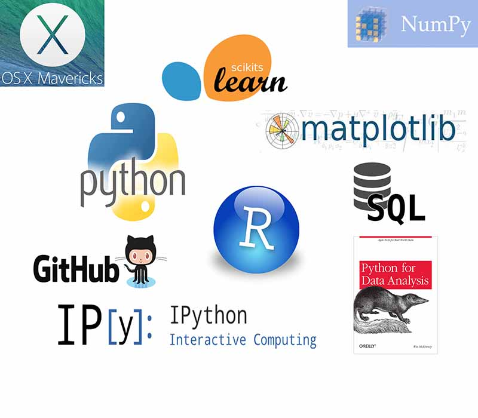

## About me

```
Background:
```
* PhD Natural Resources, University of Minnesota (December 2013)
* PyLadies (Python for female professional) co-organizer and contributor

```
Some Skills:
```
* 8 + years experience in data science and statistical analyses
* Qualifies to perform all stages of data analysis (data pulling, pre-processing, and reporting)
* Well-suited to interact cross-functionally with a wide range of people 

```
Complementary skills (Certificates):
```
* <a href="https://www.coursera.org/course/ml" target="_blank">Machine Learning</a>
* <a href="https://www.coursera.org/specialization/jhudatascience/1?utm_medium=listingPage" target="_blank">Data Science Specialization</a>

---

## Some of the tools I use




---

## Projects

The next few slides present some of my projects. They include: 

1. Two Interactive `Web Applications` using Shiny, a framework for data analysis and visualization.
2. A Data Science Project written in `IPython`.
3. A Data Science Project written in `R`.

Additionally, this `Interactive HTML5 Presentation` is written in R Markdown using Slidify.

---


## Interactive Web Application: Finance Study
Play around with this application (straight from this slide), open it in a <a href="https://prim8.shinyapps.io/Finance/" target="_blank">new browser</a> tab, or go to
<a href="https://github.com/Prim8/Web_applications/tree/master/Finance" target="_blank">Github</a> for the source code. Note: refresh the page if the graph doesn't display.

<iframe src=https://prim8.shinyapps.io/Finance/></iframe>

---

## Interactive Web Application: Ozone Study
Play around with this application (straight from this slide), open it in a <a href="https://prim8.shinyapps.io/Ozone/" target="_blank">new browser</a> tab, or go to
<a href="https://github.com/Prim8/Web_applications/tree/master/Ozone" target="_blank">Github</a> for the source code. Note: refresh the page if the graph doesn't display.

<iframe src=https://prim8.shinyapps.io/Ozone/></iframe>

---
## Data Science Project in IPython
Scroll down this document, open it in a 
<a href="http://nbviewer.ipython.org/github/Prim8/Data_Analysis_Python/blob/master/Food_truck_profits.ipynb" target="_blank">new browser</a> tab, or go to 
<a href="https://github.com/Prim8/Data_Analysis_Python" target="_blank">Github</a> for the source code.

<iframe src=http://nbviewer.ipython.org/github/Prim8/Data_Analysis_Python/blob/master/Food_truck_profits.ipynb></iframe>

---
## Data Science Project in R
Scroll down this document, open it in a 
<a href="http://htmlpreview.github.io/?https://github.com/Prim8/Data_Analysis_R/blob/master/Activity_monitoring/Activity_monitoring.html" target="_blank">new browser</a> tab, or go to 
<a href="https://github.com/Prim8/Data_Analysis_R/tree/master/Activity_monitoring" target="_blank">Github</a> for the source code.

<iframe src=http://htmlpreview.github.io/?https://github.com/Prim8/Data_Analysis_R/blob/master/Activity_monitoring/Activity_monitoring.html></iframe>

---

## And more...

For a more complete list of projects, visit my <a href="https://github.com/Prim8" target="_blank">Github</a> account. 

<iframe src=http://nbviewer.ipython.org/github/Prim8/></iframe>


